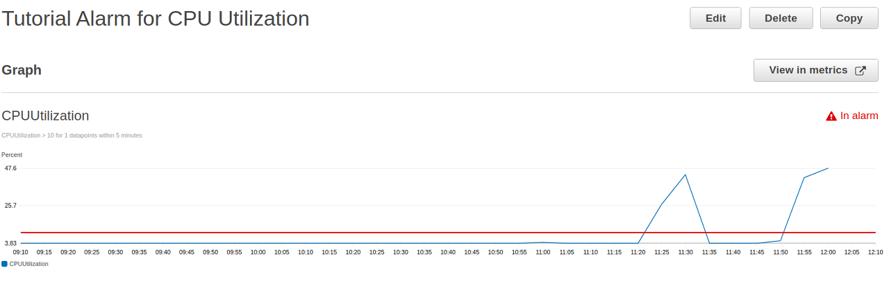
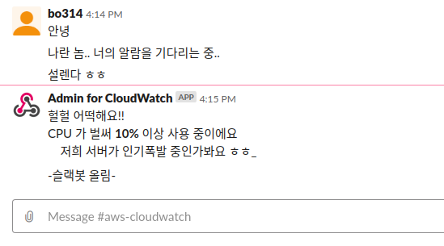

# Arichecture study 2주차

## CloudWatch와 Lambda를 이용한 간단한 SlackBot

[CloudWatch와 Lambda를 이용한 간단한 SlackBot](https://senticoding.tistory.com/85) 만드는 글을 블로그에 적어봤어요~

### 미리보기

CloudWatch 로 EC2 Instance의 CPU Utilization을 모니터링하고 Labmda로 event를 받으면 Slack에 전달한다.

## Cloud Watch 

Elastic Beanstalk을 사용하면서 Cloud Watch 에 관한 내용이 꽤나 있었어서 궁금하긴 했다.

이후 페이스북에서 우연히 Cloud Watch를 통한 서버 모니터링 이후 Slack Bot으로 알람을 받는 내용을 적은 글을 보게 되면서 더 관심이 가기도 했다.

[Cloudwatch, Lambda를 이용한 SlackBot](https://medium.com/pixelpoint/how-to-send-aws-cloudwatch-alarms-to-slack-502bcf106047)

> **프리 티어에서 사용 가능**
> CloudWatch는 프리 티어에서 무료로 사용가능 합니다. 2014년 8월 기준으로 기본 모니터링(5분 주기), 측정치(Metric) 10개, 알람(Alarm) 10개, 매달 API 요청 1,000,000건을 무료로 사용할 수 있습니다.

프리티어에서도 이용가능하다니 정말 좋은 것 같다. 기회가 된다면 도입해보고싶다.

Cloud Watch 서비스는 지원하는 각 서비스를 watch 하고 주로 Notification이나 Auto Scaling을 해주는 것 같다.

(그 서비스 중 SQS 도 있는데, 맨날 큐잉 큐잉 하는데 뭐하는 건지는 잘 모르겠음.)

## S3

저장 용량이 무한대인 http 프로토콜을 이용하는 스토리지 서비스. 마치 평소에 Nginx나 Apache 등의 웹서버로 정적파일을 제공하듯이 이용할 수 있음.

S3가 웹서버로서 정적파일을 제공하는 것 같은데, 기존의 웹하드와 같은 역할을 한다고 볼 수 있지만, 별도의 귀찮은 프로그램 설치 없이 http 통신으로 이용할 수 있다!

### S3를 사용할 때 받아들일 내용(*제맘대로 정리함*)

* 버킷 - S3에서 생성할 수 있는 디렉토리(*각 버킷을 하나의 하드디스크처럼 이용할 수 있음.*)
* 오브젝트 - 객체에 저장되는 최소 단위. 파일 자체는 아니고, 파일과 기타 메타데이터도 포함됨.
  *메타데이터는 http content-type, S3 전용 메타데이터 및 사용자 정의 메타데이터*
* **저장 가능한 용량은 무제한**
* http://{{BucketName}}.s3.amamzonaws.com/{{ObjectName}}

## CloudFront를 이용한 CDN

CloudFront서비스란.

클라이언트와 region의 거리가 멀어서 통신이 느려지는 것을 해결하기 위해, 클라이언트와 가까운 region에 캐시서버를 두는 서비스.(마찬가지로 free tier로 이용 가능)

> **캐시**
> 캐시(Cache)는 컴퓨터 및 네트워크에 전반적으로 쓰이는 단어입니다. CPU에도 캐시 메모리라는 것이 있으며 캐시 서버라는 말을 많이 사용합니다. 캐시는 속도가 빠른 곳에 임시로 데이터를 저장하여 속도를 높이는 것을 뜻합니다

책의 지문상에는 한국에서 가장 가까운 Region이 도쿄라고 적혀있던데, 옛날책이라 그런가? 서울리전 생긴 지 얼마 안돼서 그런 것 같다 ( 추측임. )

정적페이지는 파일을 캐싱하고, 이후엔 캐싱된 파일을 제공함. 동적 페이지는 EC2 인스턴스로 요청을 넘겨줌.

## RDS

*별 내용 없음*    개인적으로는 손쉬운 백업, 롤백 등이 장점인 것 같다.

## DynamoDB

아마존에서 개발한 NoSQL 데이터베이스. (모임 때 Dynamo의 엔진이 Mongo다?? 관한 내용을 들었는데, 어떤 건 지 자세히는 잘 모르겠음. 아마존에서 개발했다는 게)

### 빼놓을 것 하나 없이 잘 정리된 부분 About DynamoDB

DynamoDB를 사용해야 하는 이유는 성능과 편의성, 대규모 DB 구축에 필요한 비용을 절감하는데 있습니다. 읽기와 쓰기가 매우 빈번하고 처리 속도가 빨라야 하는 환경, 작은 용량의 데이터가 매우 많을 때, 고가용성High Availability의 분산 데이터베이스를 자체적으로 운영하기에는 부담될 때 적합합니다. 따라서 모바일 게임과 소셜 네트워크와 같은 서비스에 유용합니다. 단 관계형 데이터베이스가 아니기 때문에 트랜잭션Transaction, 조인Join과 같은 복잡한 쿼리가 필요한 환경에는 적합하지 않습니다.

DynamoDB는 RDS랑 달리 데이터 용량의 제한이 없는 듯 하다.

> RDS는 용량을 늘렸다 줄였다 해야하는 듯. 늘리는 건 그냥 늘리면 되는데, 줄이는 기능은 대부분의 볼륨과 같이 없는 듯. 갈아타야하는 것 같다.
>
> [Amazon RDS DB 인스턴스의 스토리지 크기를 줄이려면 어떻게 해야 합니까?](https://aws.amazon.com/ko/premiumsupport/knowledge-center/rds-db-storage-size/)

용량이 늘어나면 Dynamo가 알아서 스토리지를 늘리고 클러스터를 확장한다고 합니다.

즉. 샤딩을 알아서 해주는 듯.

   >*제가 몰라서 복붙하는* **샤딩**
   >샤딩(Sharding)은 데이터베이스를 분할(파티셔닝)하여 저장하는 방법입니다. 서버 한대에 대용량의 데이터베이스를 저장하기는 쉽지 않으므로 여러대에 분할하여 저장해야합니다. 테이블 별로 서버를 분할하는 방식, 사용자 이름 순, 날짜 순 등으로 분할하는 방식, 해시 키를 기준으로 분할하는 방식 등 다양한 방식이 있습니다.

[NoSQL services of AWS, DynamoDB vs DocumentDB](https://searchaws.techtarget.com/tip/DocumentDB-vs-DynamoDB-Compare-AWS-NoSQL-databases)

[*나는 아직 잘 모르지만 도움될 것 같은* 효과적인 NoSQL (Elasticahe / DynamoDB) 디자인 및 활용 방안](https://www.slideshare.net/awskorea/nosql-elasticahe-dynamodb-aws-aws-devday2018)

## 분산 in 메모리 캐시. ElasticCache

Redis를 공부하면서 ElasticCache에 대해 들어보긴했다.

캐싱을 위한 DB라고 볼 수 있다.

CloudFront가 파일을 빠르게 전송하기 위해 각지에 Caching을 위한 에지 로케이션을 두듯, ElasticCache는 DB에 대한 Caching을 지원.

자주 쓰이는 일부 데이터는 In Memory Cache에 저장하고, 전체 데이터는 DB에

### In Memory Cache

RAM에 모든 데이터를 올려놓음 (빠르다, 캐시 역할)

ex) Redis

### RDBMS

Hard Disk에 데이터를 영구적으로 저장해놓음(느리다, 사라지지 않는다.)

ex) MySQL, PostgreSQL

데이터를 안전하게 저장하는 방법일 수록 캐시의 성능은 떨어짐.

( 항상 안전과 편리성은 반비례....)

ElasticCache가 이용하는 두가지 캐시엔진

Memcached-유명한 분산 메모리 캐시 시스템. EC로 클러스터링 가능

Reids-Hash, List, Set 등의 다양한 데이터 형식을 지원하는 Key, Value 쌍 데이터 저장소. 클러스터링은 불가능. 캐시노드가 제공하는 메모리 용량을 넘어서면 샤딩을 구현해야한다.

## 마치며

평소에 써 본 서비스(S3, RDS)도 있고 나머지는 모두 궁금했던 서비스들인데, 간단하게나마 개념을 정리해볼 수 있었던 것 같다. 중간중간 잘 정리되고 이해하기 쉬운 이미지들이 있어서 좋았다.

