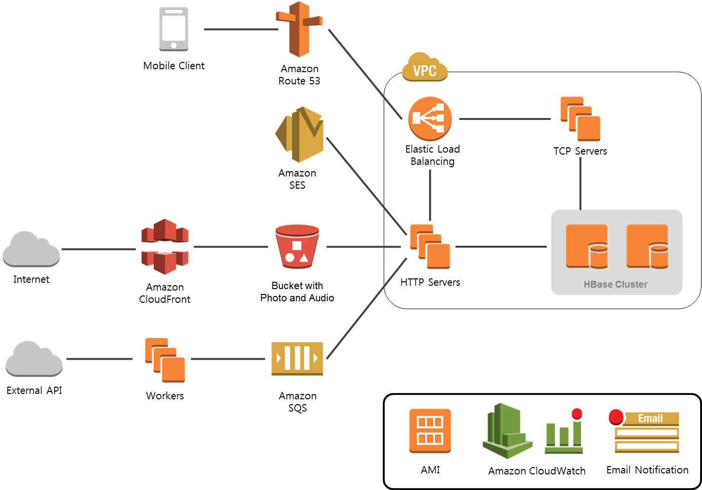

# AUSG Architecture B Study 3rd week

**VCNC Between** 의 인프라 아키텍처 조사하기

## 선정동기

- 실시간 데이터 교환과 처리 및 UI 반영에 대하여 관심이 있었음 (웹의 경우 WebSocket 등과 같은 것)
- 관련 서비스 중에서 평소 즐겨 쓰는 앱을 선정
- 자체 운영 블로그에서 여러 가지 실마리 혹은 키워드를 제공 및 다루어 줌

## VCNC의 과제

- 사용량 예측이 어려운 초기 런칭 상황에서 스토리지 확장이 용이해야 함
- IDC를 통한 자체 데이터센터 구축시 확장에 1주일 이상이 소요되는 등 시간 손실이 크고 트래픽 대응 또한 어려움
- 인력이 부족한 상황에서 인프라 관리 인력을 전적으로 배치하기 어려운 점

## AWS 사용 결정 이유

- AWS가 제공하는 다양한 기능
- 실제 글로벌 성공 사례가 다양
- "운영 개발자에게 투명하게 공개되는 AWS 서비스 운영 상태 페이지 기능을 보며 신뢰감 상승"
- 두터운 사용자 커뮤니티를 통하여 쉽게 정보 획득 및 질의 가능

## Between 아키텍처에 사용되는 AWS 서비스

- EC2
  - TCP 서버 for 채팅
  - HTTP 서버 for 사진 및 음성
- S3
- Elastic Load Balancing
- EBS
- Route 53
- CloudWatch
- AWS Support

## AWS 활용

- Amazon VPC를 통한 보안 강화
- EBS의 Provisioned IOPS 기능을 통한 일관적인 I/O 성능 보장
- 스팟 인스턴스를 사용하여 쉽게 테스트 및 성능 모니터
- EC2와 S3의 인스턴스 확장 기능을 이용하여 급증한 트래픽에 대한 용이한 대응

## Between 서버 아키텍처

- Netty 네트워크 프레임워크: Java를 사용하여 비동기 네트워킹을 할 수 있도록 해주는 프레임워크. Node.js의 비동기 구조를 떠올리면 될 듯.
- Thrift를 통한 프로토콜 정의: Apache Thrift - RPC 프레임워크
- HBase를 통한 데이터 저장: Database

### Reference

주로 VCNC 기술 블로그를 중심으로 알아보았습니다. 꼭 비트윈에 직결되는 글이 아니더라도, VCNC 블로그를 통하여 소개되는 **배포 관련된 주제의 포스트**들은 모두 참고할 만 해보입니다. 비트윈 팀에서 관련 발표를 진행한 자료를 검색하여 이 또한 함께 참고하도록 하겠습니다.

- [AWS 고객 사례: VCNC](https://aws.amazon.com/ko/solutions/case-studies/vcnc/)
- [비트윈 서버 아키텍처와 그에 따른 배포 방법](https://www.slideshare.net/awskr/aws-kr-ug-1)

- [비트윈 시스템 아키텍처](http://engineering.vcnc.co.kr/2013/04/between-system-architecture/)
- [비트윈의 스티커 시스템 구현 이야기](http://engineering.vcnc.co.kr/2013/06/architecture-of-sticker-system/)
- [비트윈의 멀티티어 아키텍처를 위한 프레젠터 이야기](http://engineering.vcnc.co.kr/2015/11/presenter-multitier-architecture/)
- [카카오 기술 블로그](https://tech.kakao.com/blog/): 주제가 다양한 편
