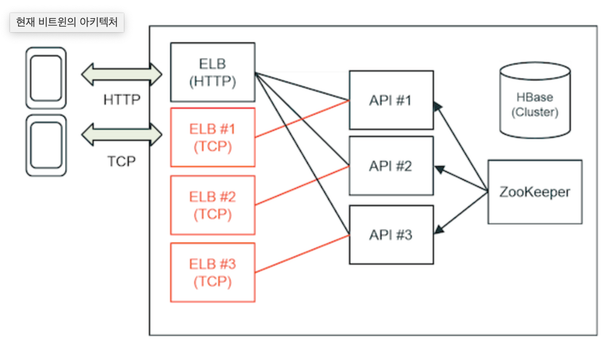
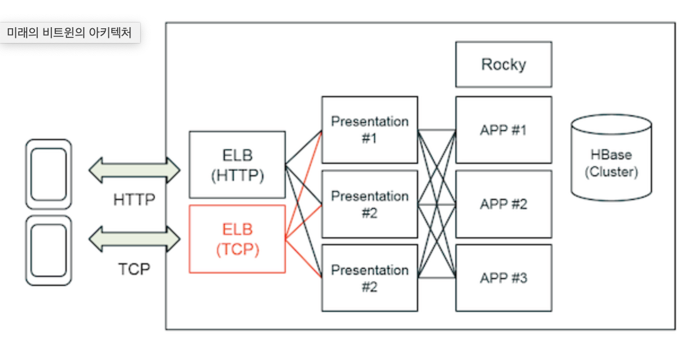

# AUSG Architecture B Study 4th week

**VCNC Between** 의 구체적인 인프라 아키텍처를 Diagram 기반으로 소개

/VCNC_Between_architecture.5c4222a6352a77357143025c9a064d77de08485c.png)

## 주의

- *AWS 인프라 서비스*들에 집중
  - 내부적으로 사용하는 소프트웨어 스택들은 생소한 것들이 너무 많았음
- 각각의 소프트웨어 스택 자체보다는 인프라 구성과 아키텍처 설계시 고려 사항들에 집중하는 것이 더 낫다고 판단

## 아키텍처의 흐름 이해

- 다수의 TCP 서버 인스턴스를 통하여 모바일 및 PC 클라이언트의 메시지 통신
- HBase 클러스터링이 이루어진 다수의 서버 인스턴스 사용하여 메시지 CRUD
- 메시지 중 사진, 음성, 영상 등의 컨텐츠 이용에는 HTTP 서버 인스턴스 이용
- Elastic Load Balancer를 통하여 각 커플들이 여러 API 인스턴스 중 하나로 연결 형성
- **2013 ~ 2015년 기준 아키텍처**

## 사용된 AWS 리소스

### EC2
- 서버 용도에 따라 다른 종류의 인스턴스 사용
  - API 서버는 주 기능이 사진 리사이징이므로, CPU 파워에 초점을 둔 c1.xlarge 인스턴스 사용
  - DB 서버는 병목 지점인 I/O 성능을 효율화하기 위하여, 메모리 성능에 초점을 둔 m2.4xlarge 인스턴스 사용
  
### Elastic Load Balancer
- 각 서버의 SSL/TLS 연결 역할
  - AWS에서 관리하는 인증서 사용으로 관련 처리에 대한 관리 부담 경감
- 클라이언트 측 요청에 대하여 각 서버에 분산

#### ELB의 개수 차이

- 기존에는 커플마다 정해진 특정 서버의 샤딩에 대한 매핑이 형성되므로, 각 커플마다 하나씩 ELB가 할당 (오픈 베타)
  - 이는 아키텍처의 복잡도를 향상시키고 Scale-up이 불가능한 구조
- Multi-tier Architecture로의 전환 후, ELB는 하나만 존재하며, 특정 커플에 대한 처리는 대응하는 APP 서버에서 전담
  - [해당 내용을 다룬 별도의 글](http://engineering.vcnc.co.kr/2015/11/presenter-multitier-architecture/)을 좀 더 읽어보고 내용 추가하겠슴다

### S3
- 사진, 음성, 영상 등 미디어 컨텐츠 저장
- 각 컨텐츠들은 익명화되어 저장
- (2013년 기준) 실질적인 사용자는 커플 각 2명에 불과하므로 Cloudfront 미사용
  - AWS에서 공식적으로 소개하는 Diagram 상에는 Cloudfront 존재

### Cloudwatch
- 서버 상태, 네트워크 상태 등을 모니터링

## 아키텍처 구현시 보완 사항
- HBase와 RPC 프레임워크에 대한 배경 지식이 없으므로, 이를 구현하지 않는 대신 대안이 필요한 상태
- (그나마 친숙한) MongoDB의 클러스터링 및 샤딩을 익히고, 이를 기반으로 채팅 기능 아키텍처를 구현

## Reference
- [AWS 고객사례: VCNC](https://aws.amazon.com/ko/solutions/case-studies/vcnc/)
- [비트윈 시스템 아키텍처](http://engineering.vcnc.co.kr/2013/04/between-system-architecture/)
