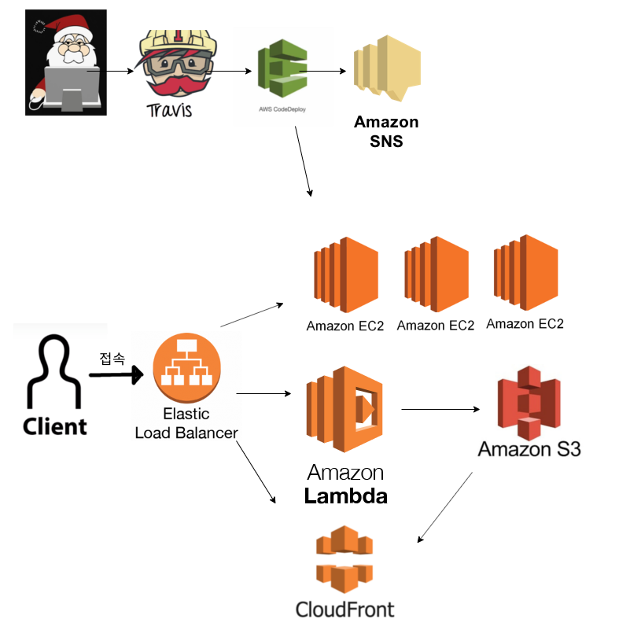

주제는 마이리얼트립의 아키텍쳐 구현이었지만,

_마이리얼트립에 특화된 서비스를 구현한다기보다는_ **다양한 AWS 서비스를 간단하게나마 이용하고 연동**시켜보는데에 초점을 맞춰보겠습니다.

## 주로 구현하고 싶은 기능

* **CI/CD, 지속적 통합 및 배포 **
  AWS의 Code Deploy를 이용하면 될 것 같은데, CI/CD 에 대한 개념이나 CI 방법에 대한 부분은 미숙함. travisCI를 써보긴했는데, travisCI나 CircleCI 등을 이용해야하는지, AWS CodeCommit 을 이용하면 되는지 알아봐야할듯.
  => CI/CD 를 구축하는 게 흥미로워보이는데, 항상 너무 다양한 선택지가 등장해서, 어떤 조합으로 가져가는 것이 좋을지 잘 모르겠음..ㅜㅜ ex) travis, Circle, CodeCommit-Build-Pipeline, Jenkins, Github Action 등등...
  => 그냥 깔끔하게 [CodePipeLine-CodeCommit 10분 자습서(en)](https://aws.amazon.com/getting-started/tutorials/continuous-deployment-pipeline/?trk=gs_card) 으로 시작해봐야겠당..
  
  [Best practices for CI/CD](https://www.lambdatest.com/blog/16-best-practices-of-ci-cd-pipeline-to-speed-test-automation/)
  
* **ELB를 이용한 load balancing 및 scaling**
  ELB를 한 번도 안 써봐서 어떤 식으로 사용하는 서비스인지 궁금함.
  aws instance scaling 도 한 번도 안 해봐서 시도해보고싶음.
  [auto scale을 이용해 EC2 자동 확장하기](https://wildpup.cafe24.com/archives/890)
  
* **scale out 되는 경우에도 session 이용하기**
  =>State 를 통합 Database에 저장한다?, 세션 클러스터링? 뭐라고 하는지 ..?
  `express redis session store example`
  [express와 redis를 이용해 session 관리하기](https://poiemaweb.com/express-session-handling)
  기왕 AWS 이용하는 거 redis 대신 elastic cache를 쓰는 것도 좋아보임. redis를 SaaS로 쓰는 것이 ElasticCache?

_뒷순위.._

* v2 로 `GraphQL API` 추가
  
* CloudFront, S3 를 이용해 신속하게 global한 정적 파일 제공
  
  => S3를 써보긴 했는데, 그냥 간단하게만 갖다 써본 게 다라서 어떤 policy등이 있는 지도 자세히 알아보고싶긴함.
  하지만, 위에 사항들이 더 궁금하기에 밀려남.
  
* Lambda 와 S3 를 이용한 Image Resizing 등의 Serverless 작업.
  딱히 어렵거나 새로울 거 없을 것 같아 뒷순위
  
* SNS나 cloud watch를 이용한 slack으로의 알림
  전에 했던 거라 뒷 순위.

## 구현해나갈 방식

주로 CI/CD 와 ELB, session 사용에 초점을 맞출 것이라, ~~어느새 마이리얼트립은 머릿 속을 떠난 듯 하기도~~. 서비스 자체에 대한 구현을 자세히 못할 듯.

그냥 mongoDB 이용해서 간단하게 여행상품 정보를 제공하는 API서버를 돌리고 (_GraphQL을 요즘 알아보고는 있지만, 그것까지 통합하긴 아직 무리일듯_. 시간이 되면 `/api/v2/` 정도로 해보고싶긴함.) CI/CD 작업을 통해 server의 배포 버전 별로 다르게 동작하는 것을 확인해보는 정도를 목표로 함!